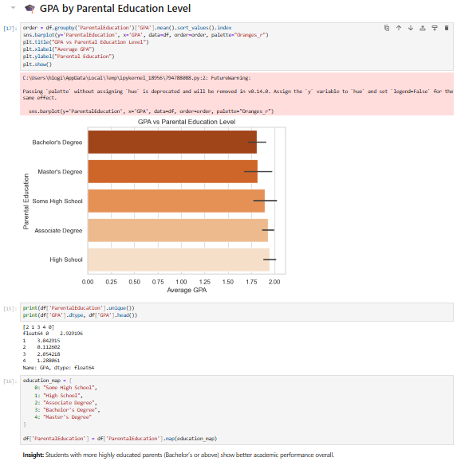

# student-performance-analysis
A data exploration project on GPA trends using Python, Seaborn, and Jupyter.

# 🎓 Student Performance Analysis

A visual deep dive into how GPA is affected by tutoring, parental support, extracurriculars, and more.

## 🔍 What’s Inside
- 📊 Clean Seaborn graphs
- 📘 Insight summaries after each plot
- 📚 Jupyter Notebook format
- 🔎 Columns explored: GPA, Gender, Tutoring, Support, Grade, Education

## 💡 Sample Output

✅ Part of my Data Science Re-learning Portfolio  
🔗 Open the notebook: `student_performance_analysis.ipynb`
